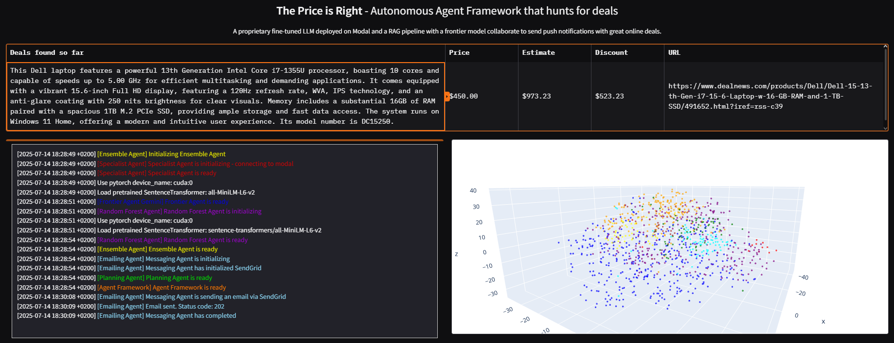

# Pricer Agent

An intelligent pricing system that scans websites for products and their prices, predicts the real market price, evaluates if it is a good deal, and presents the results through a Gradio interface with email notifications.

## Overview

This project implements a multi-agent system that scans websites for product listings and prices, predicts the real market price using various AI and machine learning models, compares predicted prices with actual prices to identify good deals, and notifies users via a Gradio web interface and email alerts.

The system combines different pricing strategies through specialized agents:

- **Specialist Agent**: Expert system for specific product categories, hosted on Modal as a fine-tuned LLM
- **Frontier Agent**: Advanced pricing analysis using cutting-edge AI models
- **Random Forest Agent**: Machine learning based price prediction
- **Ensemble Agent**: Combines predictions from all agents using weighted averaging (Linear Regression)
- **Scanner Agent**: Processes and normalizes price data
- **Planning Agent**: Coordinates between the scanner agent, which looks for deals, the ensemble agent, responsible for pricing and identifying deals, and the emailing agent, which sends the notification for the best possible deal.

## Features

- Scans websites for product data and prices
- Predicts real market prices using AI and machine learning
- Compares predicted prices with actual prices to identify good deals
- Multi-agent architecture for robust and modular pricing strategies
- Ensemble learning approach combining multiple pricing models
- Price normalization and data cleaning capabilities
- User-friendly Gradio interface for deal visualization
- Email notifications for alerting users about good deals
- Modular design allowing easy extension with new agents
- Integration with modern AI models and frameworks



## Prerequisites

- Python 3.8 or higher
- pip package manager
- Virtual environment (recommended)

## Installation

1. Clone the repository
2. Create and activate a virtual environment (recommended):
```bash
python -m venv venv
source venv/bin/activate  # On Windows use: venv\Scripts\activate
```

3. Install the required dependencies:
```bash
pip install -r requirements.txt
```

Key dependencies include:
- Machine Learning: numpy, pandas, scikit-learn, torch
- AI/LLM Integration: transformers, openai, langchain, anthropic
- Vector Storage: faiss-cpu, chromadb
- Data Processing: beautifulsoup4, sentence-transformers
- Visualization: matplotlib, plotly, jupyter-dash, gradio
- Development Tools: jupyterlab

## Usage

To run the Gradio interface for browsing deals and interacting with the system, run:

```bash
python pricer_agent_script_final.py
```

The system will scan websites, predict prices, evaluate deals, and display results in the web interface.

Email notifications will be sent automatically when good deals are found or when you click on the deal in the Gradio interface.

The fine-tuned LLM used by the Specialist Agent is hosted on Modal, a platform that enables scalable deployment of machine learning models.

## Contributing

Contributions are welcome! Please feel free to submit a Pull Request.

## License

This project is licensed under the MIT License - see the LICENSE file for details.